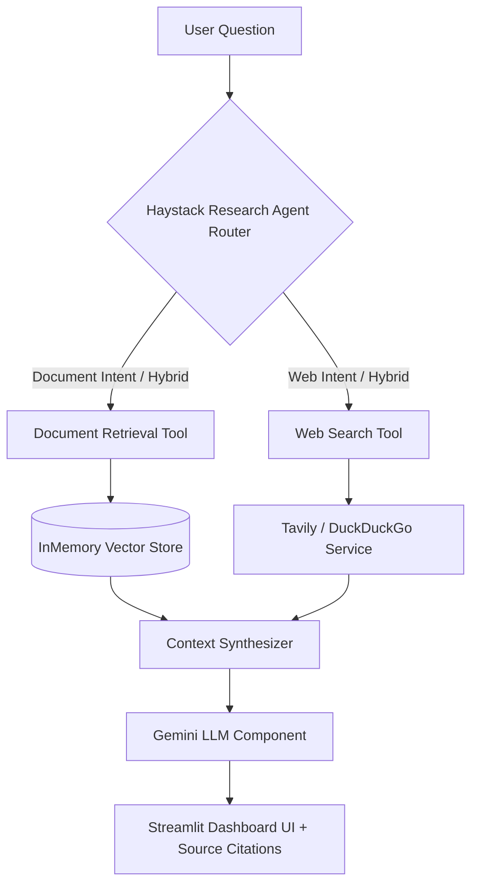

# 🧠 RAG + Web AI Research Agent with Haystack AI 2.x


An intelligent, production-grade **RAG + Web AI Research Assistant** built with **Haystack AI 2.x**, **Google Gemini LLM**, and **Streamlit**.

The agent dynamically decides whether to search local uploaded documents (PDF, TXT, DOCX), retrieve real-time live web search results, or perform a hybrid research synthesis with multi-source citation badges.

---

## 🌟 Key Features

- 📄 **Multi-Format Document Processing**: Upload and index PDF, TXT, and DOCX files with sentence-boundary chunking.
- 🔍 **Local Vector Retrieval**: Fast semantic similarity search using HuggingFace `SentenceTransformers` (`all-MiniLM-L6-v2`) and `InMemoryDocumentStore`.
- 🤖 **Autonomous Research Agent**: Intelligent intent router automatically choosing between:
  - **`Local Documents`**: For facts contained in uploaded files.
  - **`Live Web Search`**: For real-time topics, current news, and external facts.
  - **`Hybrid Mode`**: Synthesizes local document facts and live web search results into an authoritative answer.
- 🌐 **Dual Web Search Service**: Tavily API support with automatic zero-cost DuckDuckGo fallback.
- 🎨 **Modern Dashboard UI**: Glassmorphic UI with prompt starters, live knowledge base inspector, settings hub, and analytics.
- 📌 **Source Citations**: Formatted citations linking document page numbers and live web source URLs.

---

## 🏗️ Architecture & Pipeline Flow



---

## 📁 Repository Structure

```text
.
├── app.py                      # Streamlit Web Application (4-Tab Dashboard)
├── src/
│   ├── config.py               # Central Environment & App Configuration
│   ├── ingestion/              # Ingestion Pipeline
│   │   ├── document_loader.py  # PDF, TXT, DOCX Loader
│   │   ├── chunker.py          # Haystack DocumentSplitter
│   │   └── indexer.py          # SentenceTransformers Embedding Generator
│   ├── rag/                    # RAG Pipeline Components
│   │   ├── document_store.py   # Vector Store Manager
│   │   ├── retriever.py        # Semantic Vector Retriever
│   │   ├── prompt.py           # Prompt Builder
│   │   └── pipeline.py         # Full RAG Pipeline Orchestrator
│   ├── llm/                    # Custom LLM Generator
│   │   └── generator.py        # Custom Haystack Component wrapping Google Gemini
│   ├── web/                    # Web Search Service
│   │   └── search.py           # Tavily + DuckDuckGo Web Search Engine
│   └── agent/                  # AI Research Agent
│       ├── tools.py            # Haystack Agent Tool Definitions
│       └── research_agent.py   # Autonomous Research Router & Synthesizer
├── tests/                      # Pytest Test Suite (23 Unit Tests)
├── data/                       # Document Data Directories
├── requirements.txt            # Python Dependencies
├── .env.example                # Example Environment Variables Template
└── README.md                   # Project Documentation
```

---

## ⚡ Quick Start & Installation

### 1. Clone the Repository
```bash
git clone https://github.com/YOUR_USERNAME/rag-web-ai-research-agent.git
cd rag-web-ai-research-agent
```

### 2. Create and Activate Virtual Environment
```bash
python -m venv venv
# On Windows:
.\venv\Scripts\activate
# On macOS/Linux:
source venv/bin/activate
```

### 3. Install Dependencies
```bash
pip install -r requirements.txt
```

### 4. Configure Environment Variables
Copy `.env.example` to `.env` and set your API keys:
```bash
cp .env.example .env
```

Edit `.env`:
```env
GEMINI_API_KEY=your_gemini_api_key_here
TAVILY_API_KEY=your_tavily_api_key_here  # Optional
```

---

## 🚀 Running the Web Application

```bash
streamlit run app.py
```
Open your browser to `http://localhost:8501`.

---

## 🧪 Running Unit Tests

Run the full pytest suite across all modules:

```bash
pytest tests/ -v
```

---

## 📜 License
This project is licensed under the MIT License.
